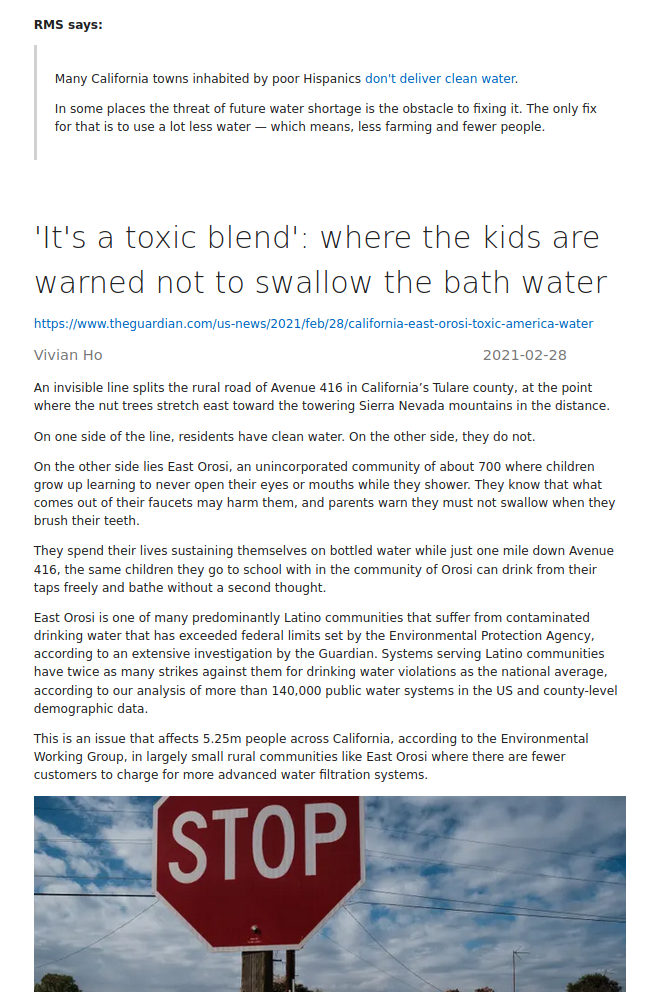

# The Daily Stallman
Read the news like Stallman would. No JavaScript required.

The Daily Stallman reads the stallman.org RSS news feed, downloads articles and merges them into 
a single HTML file.



## Install
```cargo install the-daily-stallman```

## Usage
To run the-daily-stallman and save the latest 10 articles to a file called `tds.html` in the current directory:
```
tds
```

Use the `-o` option to change where the HTML is written to:
```
tds -o ~/news.html
```

Use the `-b` option to write to a temporary file that is opened automatically in your browser:
```
tds -b firefox
```

By default, the 10 latest articles are downloaded. Today's articles can be downloaded with 
the `--today` flag:
```
tds --today
```
and yesterday's articles with the `--yesterday` flag:
```
tds --yesterday
```
The latest N articles can be downloaded with the `--latest` option:
```
tds --latest 20
```

## TODO
* Enable full offline reading by downloading article images.
* Add feature to output epub/mobi instead of HTML for reading on e-readers.
* Table of contents.
